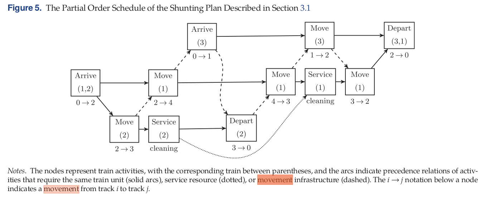

# Robust Rail Solver 
Also known as Baseline HIP. 

Table of contents
- [Robust Rail Solver](#robust-rail-solver)
- [Description](#description)
    - [robust-rail-solver](#robust-rail-solver-1)
    - [Evaluation of the Plan](#evaluation-of-the-plan)
    - [Scenario generation](#scenario-generation)
  - [How To Use?](#how-to-use)
    - [Create Plan with Tabu and Local Search methods - from configuration file](#create-plan-with-tabu-and-local-search-methods---from-configuration-file)
    - [Create Plan with Tabu and Local Search methods](#create-plan-with-tabu-and-local-search-methods)
    - [Location Scenario Parsing](#location-scenario-parsing)
  - [Validated scenarios](#validated-scenarios)
  - [Partial Order Schedule (POS) - Other helper functions](#partial-order-schedule-pos---other-helper-functions)
    - [Helper functions:](#helper-functions)
- [Build as standalone tool](#build-as-standalone-tool)
  - [Building process - Native support (Linux)](#building-process---native-support-linux)
  - [Dependencies](#dependencies)
    - [First step:](#first-step)
  - [Publishing the HIP image](#publishing-the-hip-image)
    - [`edge`: running a fix before it's merged](#edge-running-a-fix-before-its-merged)


# Description 
This tool is the `baseline version` of the research outcome of a published paper by Roel van den Broek: [A Local Search Algorithm for Train Unit Shunting with Service Scheduling](https://pubsonline.informs.org/doi/10.1287/trsc.2021.1090).
The paper considers train unit shunting problem extended with service task scheduling. This problem originates from Dutch Railways, which is the main railway operator in the Netherlands. The study presents the first solution method covering all aspects of the shunting and scheduling problem. The problem consists of matching train units arriving at a shunting yard to departing trains, scheduling service tasks such as cleaning and maintenance on the available resources, and parking the trains on the available tracks such that the shunting yard can operate conflict-free. Partial order schedule representation that captures the full problem is also elaborated, and local search algorithm that utilizes the partial ordering has been applied. 
An earlier contribution to that research paper is [Train Shunting and Service Scheduling: an integrated local search approach](https://studenttheses.uu.nl/handle/20.500.12932/24118).

### robust-rail-solver 
- Input:
    * Location (e.g., shunting yard)
    * Scenario (e.g., train arrivals/departures - time/train types) 
- Output:
    * Plan - scheduled actions with the respect of service tasks done and the departure times


### Evaluation of the Plan
The plan produced by the solver can be further evaluated by [robust-rail-evaluator](https://github.com/Robust-Rail-NL/robust-rail-evaluator), which verifies if all the actions taken in the plan are valid and respecting the corresponding scenario and location.

### Scenario generation
[robust-rail-generator](https://github.com/Robust-Rail-NL/robust-rail-generator) tool helps to make scenario generation easier. The generated scenario respects the format used by [robust-rail-evaluator](https://github.com/Robust-Rail-NL/robust-rail-evaluator) and [robust-rail-solver](https://github.com/Robust-Rail-NL/robust-rail-solver).


## How To Use?


The [main program](Program.cs) contains several functions with different features.

### Create Plan with Tabu and Local Search methods - from configuration file

Usage: 
```bash
cd ServiceSiteScheduling
dotnet run -- --config=./config.yaml
```
Where [config.yaml](./ServiceSiteScheduling/config.yaml) contains all the parameters needed to specify path to the `location file`, `scenario file` and to define path of the `plan file`. Moreover, the configuration parameters for the Tabu Search and Simulated Annealing are also included in this config file. 

**Details about the parameters**: Explained below (Create Plan with Tabu and Local Search methods).


### Create Plan with Tabu and Local Search methods

* This function takes as input the path to location file `location_path` and the path to the scenario file `scenario_path`. 
    * E.g., of the location is shunting yard - [location.json](./example_kleine_binckhorst/location.json). 
    * E.g., of the scenario is the time of arrivals & departures, train types/composition - [scenario.json](./example_kleine_binckhorst/scenario.json).

* The function returns a schedule plan as solution to the scenario. The function uses Tabu Search and Simulated Annealing methods to find a Totally Ordered Graph which is finally converted into a schedule plan.
    *  The plan is stored in JSON format and the path/name of the plan defined by `plan_path` input argument (e.g., example_kleine_binckhorst/plan.json).  

```bash
CreatePlan(string location_path, string scenario_path, string plan_path)
```

*Note*: default the parameters are used for the Tabu Search and Simulated Annealing methods. However, these parameters can be modified.

* **Tabu Search parameters**:
    * **iterations**: maximum iterations in the searching algorithm if it is achieved the search ends
    * **iterationsUntilReset**: the current solution should be improved until that number of iteration if this number is hit, the current solution cannot be improved → the current solution is reverted to the original solution
    * **tabuListLength**: length of the tabu search list containing LocalSearchMoves → solution graphs
    * **bias**: restricted probability (e.g., 0.75)
    * **suppressConsoleOutput**: enables extra logs


* Example of usage: `ts.Run(40, 100, 16, 0.5);`

* **Simulated Annealing parameters**:

    * **maxduration**: maximum duration of the search in seconds (e.g., Time.Hour is 3600 seconds)
    * **stopWhenFeasible**: stops search when it is feasible (bool)
    * **iterations**: maximum iterations in the searching algorithm if it is achieved the search ends
    * **t**: the T parameter in the equation P = exp([cost(a') - cost(b')]/T), where e T is a control parameter that will be decreased during the search to accept less deterioration in solution quality later on in the process
    * **a**: the rate of the decrease of T (e.g., a=0.97 → 3% of decrease every time q iteration has been achieved)
    * **q**: number of iterations until the next decrease of T (e.g., 2000)
    * **reset**: the current solution should be improved until that number of iteration if this number is hit, the current solution cannot be improved → the current solution is reverted to the original solution (e.g., 2000)
    * **bias**: restricted probability (e.g., 0.4)
    * **suppressConsoleOutput**: enables extra logs
    * **intensifyOnImprovement**: enables further improvements

* Example of usage: `sa.Run(Time.Hour, true, 150000, 15, 0.97, 2000, 2000, 0.2, false);`

Usage: 
```bash
cd ServiceSiteScheduling
dotnet run
```

### Location Scenario Parsing

It is advised to first call `Test_Location_Scenario_Parsing(string location_path, string scenario_path)` function:
* It will test if the given location and scenario (json format) files can be parsed correctly into a `ProblemInstance`. As part of the test, the overall infrastructure of the location (e.g., track parts) will be displayed. If the parsing of `location_solver.json` is successful, the json format location will be displayed. When the parsing of `scenario_solver.json` is successful, the json format scenario will be displayed and some details about the Incoming and Outgoing trains.

Usage of the parsing test:
```bash
Test_Location_Scenario_Parsing(string location_path, string scenario_path)
```
Example: 

```bash
Test_Location_Scenario_Parsing("../example_kleine_binckhorst/location.json", "../example_kleine_binckhorst/scenario.json");
```


## Validated scenarios
Some of the scenarios were successfully solved by [robust-rail-solver](https://github.com/Robust-Rail-NL/robust-rail-solver) and the plans were validated by [robust-rail-evaluator](https://github.com/Robust-Rail-NL/robust-rail-evaluator). All the validated scenarios and location files are collected under [robust-rail-general](https://github.com/Robust-Rail-NL/robust-rail-general) repository.

- [**`example_kleine_binckhorst/`**](./example_kleine_binckhorst/) - a single Kleine Binckhorst scenario (6 trains), used as the smoke-test/demo fixture by the no-`--config` run, CI, and [`config.yaml`](./ServiceSiteScheduling/config.yaml)
    - **location.json** - Kleine Binckhorst location
    - **scenario.json** - 6 trains custom config scenario
    - **plan.json** - plan corresponding to the scenario

## Partial Order Schedule (POS) - Other helper functions 

There are optional functions to display movement actions and other Partial Order Schedule graphs (relations among the actions i.e., moves using the same infrastructure, service resource, activities that require the same train unit). Example of the partial order schedule of a shunting plan. . Reference to the figure: [A Local Search Algorithm for Train Unit Shunting with Service Scheduling](https://pubsonline.informs.org/doi/10.1287/trsc.2021.1090), by Roel van den Broek.

### Helper functions: 
These functions are optional they help to display the current partial order schedule and look for relations between the actions during the Local Search.
* `InitializePOS`: Initialize some values needed to create the POS structure
* `CreatePOS`: Creates a Partial Order Schedule representation from the Totally ordered Solution

Usage:
```bash
POS = new PartialOrderSchedule(start);
POS.InitializePOS();
POS.CreatePOS();
```
Where `start` is the first MoveTask of the totally ordered solution in the `PlanGraph`. Typically, it should be called in the end of the `ComputeLocation()` see `SolutionCost ComputeModel()` -> `ComputeLocation()` in `PlanGraph.cs`.
 
 After the POS is created many functions can be called: 


* `ShowAllInfoAboutTrackTask`: Shows all kind of information about a specific track task

* `ShowAllInfoAboutMove`: Shows all kind of information about a specific Move

* `GetMoveLinksOfPOSMove`: Get all the direct successors and predecessors of a given POS move, the move is identified by its ID (POSMoveTask POSmove.ID). Successors stored in @successorPOSMoves; Predecessors stored in @predecessorsPOSMoves @linkType specifies the type of the links 'infrastructure' - same infrastructure used - populated from @POSadjacencyListForInfrastructure 'trainUnit' - same train unit(s) used - populated from @POSadjacencyListForTrainUnit
      
* `DisplayListPOSTrackTask`: Displays the all POSTrackTask list identified in the POS solution


* `DisplayTrainUnitSuccessorsAndPredeccessors`: Displays all the POSMove predecessors and successors - these links are represents the relations between the moves using the same train unit


* `DisplayMoveLinksOfPOSMove`: Displays all the direct successors and predecessors of a given POS move the move is identified by its ID (POSMoveTask POSmove.ID) @linkType specifies the type of the links 'infrastructure' - same infrastructure used - populated from @POSadjacencyListForInfrastructure 'trainUnit' - same train unit(s) used - populated from @POSadjacencyListForTrainUnit

* `DisplayPOSMovementLinksTrainUnitUsed`: Shows train unit relations between the POS movements, meaning that links per move using the same train unit are displayed - links by train unit
 

* `DisplayPOSMovementLinksInfrastructureUsed`: Shows infrastructure relations between the POS movements, meaning that links per move using the same infrastructure are displayed - links by infrastructure


* `DisplayAllPOSMovementLinks`: Shows all the relations between the POS movements, meaning that all kind of links per move are displayed - links by infrastructure links by same train unit used


* `DisplayInfrastructure`: Shows the Infrastructure of the given location (e.g., shunting yard)


* `DisplayMovements`: Shows rich information about the movements and infrastructure used in the Totally Ordered Solution

# Build as standalone tool
In principle the robust-rail tools are built in a single Docker do ease the development and usage. Nevertheless, it is possible to use/build `robust-rail-solver` as a standalone tool.


## Building process - Native support (Linux)
## Dependencies

To ensure that the code compiles, **dotnet net8.0 framework is required**. The code was tested with `dotnet v8.0.404`.

If you are an Ubuntu user, please go to [Install .NET SDK]("https://learn.microsoft.com/en-us/dotnet/core/install/linux-ubuntu-install?pivots=os-linux-ubuntu-2204&tabs=dotnet9") and choose your Ubuntu version.


### First step:
Example of installation on Ubuntu 20.04:

```bash
wget https://packages.microsoft.com/config/ubuntu/20.04/packages-microsoft-prod.deb -O packages-microsoft-prod.deb
sudo dpkg -i packages-microsoft-prod.deb
rm packages-microsoft-prod.deb
sudo apt-get update
```
After the packages are located:

```bash
sudo apt-get install -y dotnet-sdk-8.0
```


Other packages might also be needed to be installed on the system:
* ca-certificates
* libc6
* libgcc-s1
* libgssapi-krb5-2
* libicu70
* liblttng-ust1
* libssl3
* libstdc++6
* libunwind8
* zlib1g


```bash
sudo apt install name-of-the-package
```

## Publishing the HIP image
`HIP.csproj`'s `<Version>` element is the single source of truth for the image version — it is baked into the Docker image (via build-arg) as the `org.opencontainers.image.version` label, and used as the image tag, so it never needs updating in more than one place.

To bump it, use [`bump-version.sh`](ServiceSiteScheduling/bump-version.sh):
```bash
cd ServiceSiteScheduling
./bump-version.sh patch        # 1.4.1 -> 1.4.2
./bump-version.sh minor        # 1.4.1 -> 1.5.0
./bump-version.sh major        # 1.4.1 -> 2.0.0
./bump-version.sh prerelease   # 2.0.0-alpha.1 -> 2.0.0-alpha.2
./bump-version.sh 3.0.0-beta.2 # set an explicit version
```

Then [`docker-push.sh`](ServiceSiteScheduling/docker-push.sh) builds and pushes the multi-arch (`linux/amd64,linux/arm64`) HIP image to `ghcr.io/robust-rail-nl/hip`, tagged with the current `HIP.csproj` version:

```bash
./docker-push.sh
```

The `:latest` tag is only applied for final `1.x.y` releases — prerelease versions (including the `noproto` branch's `2.0.0-alpha.*` line) are pushed under their own tag only, so they never shadow the current stable image.

The script creates a dedicated `buildx` builder (`robust-rail-builder`) using the `docker-container` driver with `network=host`. This is required on some machines: the default `docker-container` driver runs BuildKit in an isolated network namespace whose DNS resolution can fail to reach private/LAN DNS servers, causing errors like:

```
failed to resolve source metadata for mcr.microsoft.com/dotnet/sdk:8.0: ... dial tcp: lookup mcr.microsoft.com on <lan-ip>:53: i/o timeout
```

This typically shows up as `docker build` working fine while `docker buildx build` times out. `network=host` makes the builder container share the host's network stack, sidestepping the issue. If you already have a stale builder without this option, remove it first with `docker buildx rm robust-rail-builder`.

The builder is shared across sibling `Robust-Rail-NL` projects that also need multi-arch/`network=host` builds (e.g. `robust-rail-evaluator`) — a `buildx` builder isn't tied to a specific repo, so there's no need for a separate one per project.

### `edge`: running a fix before it's merged

Alongside the reviewed-release tags above, `ghcr.io/robust-rail-nl/hip:edge` is a floating tag tracking the `edge` branch — a lower-ceremony channel for running a fix without waiting for its PR into `main` to be reviewed. It's published manually via [`docker-push-edge.sh`](ServiceSiteScheduling/docker-push-edge.sh). See [`CONTRIBUTING.md`](CONTRIBUTING.md) for how `edge` relates to `main`, the image's version string, and why publishing it isn't automated.